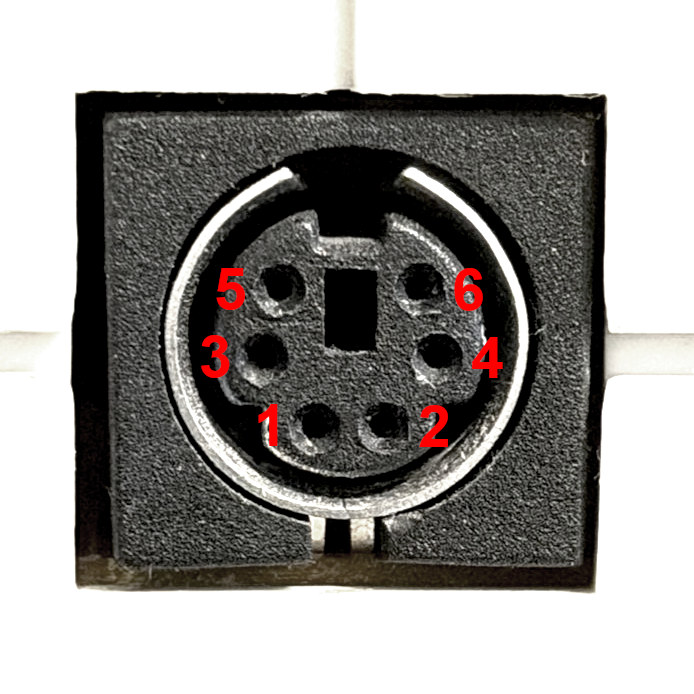

# smartport_arduino
An Arduino sketch that listens to commands from its USB serial interface to perform commands via the SmartPort protocol

## SmartPort pinout

| SmartPort | Arduino | Function |
|---|---|---|
| 1 | 12 | MISO |
| 2 | 13 | Serial Clock |
| 3 | - | Frame End |
| 4 | 11 | MOSI |
| 5 | GND | Ground |
| 6 | 8 | Slave Ready |
| - | 9 * | Slave Ready (Virtual) |
| - | 10 * | Slave Select |

*\* Pins 9 and 10 connect to eachother instead of the SmartPort*

*\*\* Many diagrams will flip the orientation of these pins horizontally. The image above is looking at the face of the port*

## Other projects

### https://github.com/stepstools/Rokenbok-Smart-Port-WiFi
Custom ESP32 controller with web interface

### https://github.com/jordan-woyak/rokenbok-smart-port
Arduino controller

### https://github.com/rgill02/rokenbok
Arduino controller with Python client, server, and hub
