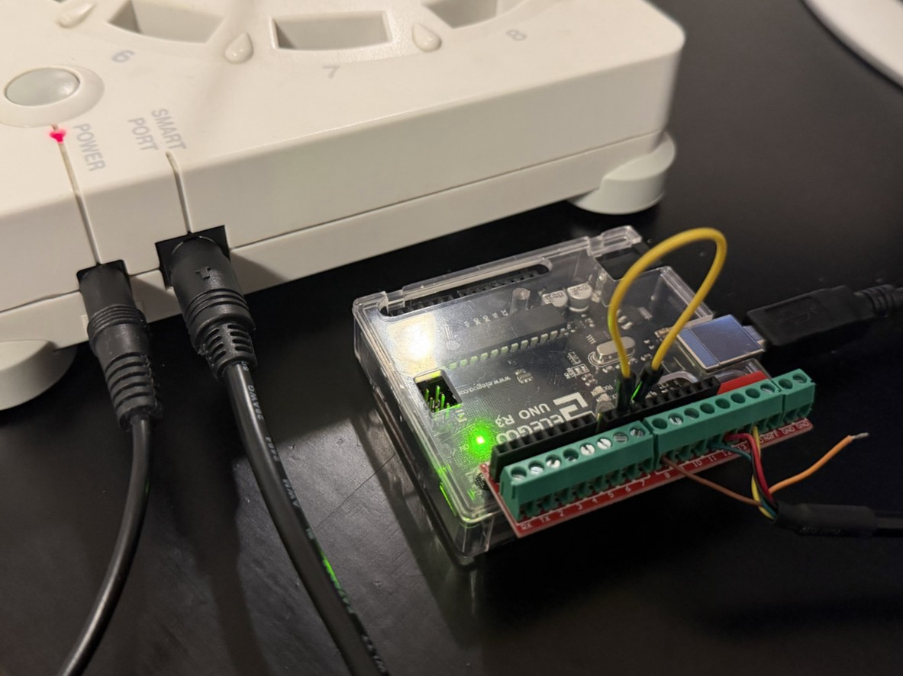

# smartport_arduino

An Arduino sketch for communication with the Rokenbok SmartPort via serial commands

## Requirements

- [Arduino IDE](https://www.arduino.cc/en/software) (for installation on the Arduino)
- Rokenbok Command Deck (Gen 1)
- 5V logic Arduino with USB over Serial support (Uno recommended)
- Mini-DIN 6 Cable (The SmartPort connector)

## Installation and configuration

1. Download the `smartport_arduino.ino` sketch from the [release files](https://github.com/csev1755/rokenbok-webserver/releases) for the server version you're using

2. [Install the sketch with Arduino IDE](https://support.arduino.cc/hc/en-us/articles/4733418441116-Upload-a-sketch-in-Arduino-IDE) and make note of the serial device name/path

3. Modify the following settings in [rokenbok_webserver.ini:](/rokenbok_webserver.ini)

    - Add the serial device name/path you noted earlier as `serial_port` under `[smartport_arduino]`

        ```ini
        [smartport_arduino]
        serial_port = COM3 # Replace with what was shown in the Arduino IDE
        ```

    - Add the name of each of the vehicles connected along with their number under `[smartport_arduino.vehicles]`

        ```ini
        [smartport_arduino.vehicles]
        1 = Dozer
        2 = Skiptrack
        3 = Loader
        # ... and so on ...
        ```

## Connecting to the command deck

An easy way to get set up is buying a screw terminal HAT or adapter along with a Mini-DIN 6 breakout cable to make a solid connection without any soldering needed as shown below:



### SmartPort Pinout


| SmartPort Pin | Arduino Pin | Function |
| --- | --- | --- |
| 1 | 12 | MISO |
| 2 | 13 | Serial Clock |
| 3 | - | Frame End |
| 4 | 11 | MOSI |
| 5 | GND | Ground |
| 6 | 8 | Slave Ready |
| - | 9 * | Slave Ready (Virtual) |
| - | 10 * | Slave Select |

*\* Pins 9 and 10 connect to eachother instead of the SmartPort*

*\*\* Many diagrams will flip the orientation of these pins horizontally. The image above is looking at the face of the port*

## Other projects

### https://github.com/stepstools/Rokenbok-Smart-Port-WiFi

Custom ESP32 controller with web interface

### https://github.com/jordan-woyak/rokenbok-smart-port

Arduino controller

### https://github.com/rgill02/rokenbok

Arduino controller with Python client, server, and hub
