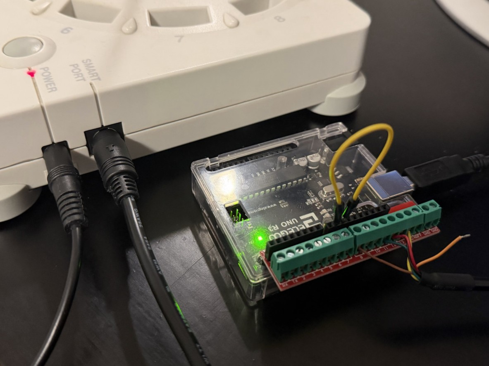
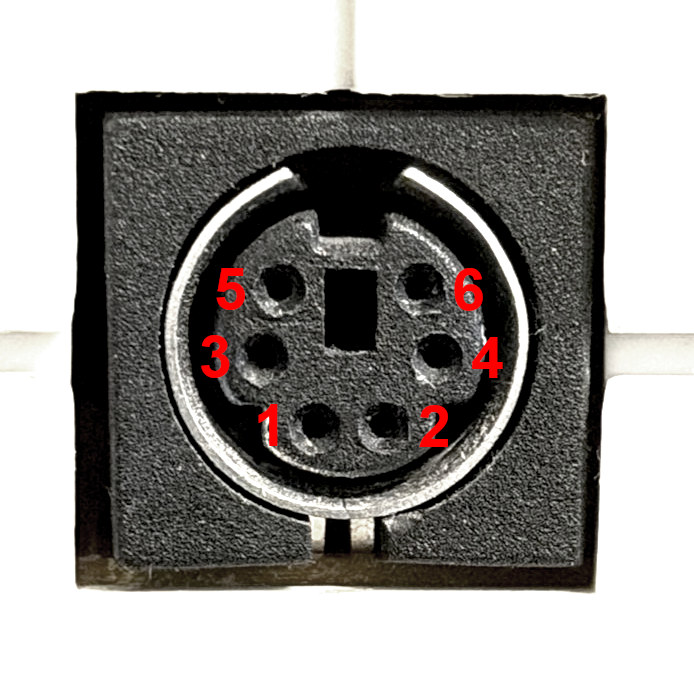

SmartPort Arduino
=================

Rokenbok vehicles can be controlled using an Arduino connected to the SmartPort on a Command Deck. This allows for up to 15 vehicles to be controlled with up to 12 controllers.

Requirements
------------

- Arduino IDE (for installation on the Arduino)
- Rokenbok Command Deck (Gen 1)
- 5V logic Arduino with USB-over-serial support (Uno recommended)
- Mini-DIN 6 cable (the Smartport connector)

Configuration
------------------------------

1. Download the ``smartport_arduino.ino`` sketch from the `release files <https://github.com/csev1755/rokenbok-webserver/releases>`_ of the server version you're using
2. `Install the sketch with Arduino IDE <https://support.arduino.cc/hc/en-us/articles/4733418441116-Upload-a-sketch-in-Arduino-IDE>`_ and make note of the serial device name/path
3. Modify the following in ``settings.ini``:

   - Add the serial device name/path you noted earlier as ``serial_port`` under the ``[smartport_arduino]`` section:

   .. code-block:: ini

      [smartport_arduino]
      serial_port = COM3  # Replace with what was shown in the Arduino IDE

   -  Add the name of each of the vehicles connected along with their number under ``[smartport_arduino.vehicles]``:

   .. code-block:: ini

      [smartport_arduino.vehicles]
      1 = Dozer
      2 = Skiptrack
      3 = Loader
      # ... and so on ...

Wiring the Arduino to the Command Deck
--------------------------------------

An easy way to get set up is buying a screw terminal HAT or adapter along with a Mini-DIN 6 breakout cable to make a solid connection without any soldering needed as shown below:

SmartPort pinout
~~~~~~~~~~~~~~~~

.. list-table::
   :header-rows: 1
   :align: left

   * - SmartPort pin
     - Arduino pin
     - Function
   * - 1
     - 12
     - MISO
   * - 2
     - 13
     - Serial clock
   * - 3
     - `-`
     - Frame end
   * - 4
     - 11
     - MOSI
   * - 5
     - GND
     - Ground
   * - 6
     - 8
     - Slave ready
   * - `-`
     - 9 *
     - Slave ready (virtual)
   * - `-`
     - 10 *
     - Slave select

\* Pins 9 and 10 are connected to each other instead of the SmartPort. This can be done with a breadboard jumper wire or even a paperclip.

\*\*  Many diagrams will flip the orientation of these pins horizontally. The image above is looking at the face of the port
